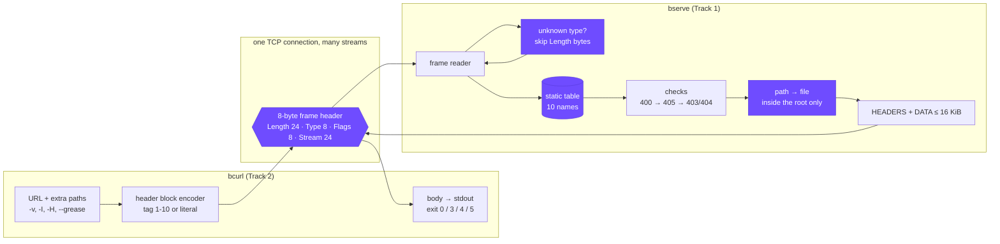
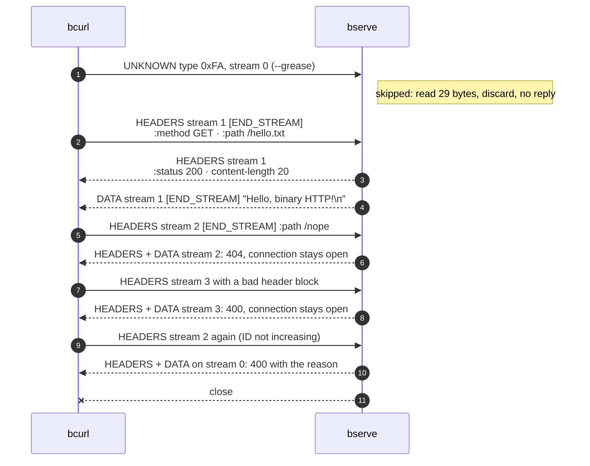

# bhttp-network-architecture

> HTTP, in binary. A two-page protocol spec (BHTTP/1), a file server that speaks it (`bserve`), a curl-like client (`bcurl`), and a byte-by-byte annotated hexdump of one request and response. Frames have a fixed **8-byte header**, header names come from a **10-entry static table** or are sent as length-prefixed literals, and every receiver **skips frame types it does not know**, which is what leaves room for a version 2.


[](https://github.com/mohit-1710/bhttp-network-architecture/actions/workflows/ci.yml)

---

## Architecture

The two programs share nothing at run time except bytes on one TCP connection, and the only thing that defines those bytes is [SPEC.md](SPEC.md). The four parts in **purple** are where the design decisions are: the fixed frame header, the rule for unknown frame types, the static header table, and keeping every path inside the document root.



### One connection, start to finish

bcurl numbers its requests 1, 2, 3 on a single connection. A 404 or a malformed request is answered on its own stream and the connection carries on. Only a broken frame sequence (here a stream ID going backwards) gets a `400` on stream 0 and a close.



### Reading a frame

Every receiver, client or server, runs the same loop. The `Length` field is why the unknown-type rule is safe: a v1 peer always knows how far to skip, even past frame types invented later.


The full rules are in **[SPEC.md](SPEC.md)** (also as a two-page **[docs/SPEC.pdf](docs/SPEC.pdf)**). Every byte of a real exchange is explained in **[HEXDUMP.md](HEXDUMP.md)**.

---

## The frame

```
 0                   1                   2                   3
 0 1 2 3 4 5 6 7 8 9 0 1 2 3 4 5 6 7 8 9 0 1 2 3 4 5 6 7 8 9 0 1
+-----------------------------------------------+---------------+
|                 Length (24)                   |   Type (8)    |
+---------------+-----------------------------------------------+
|   Flags (8)   |               Stream ID (24)                  |
+---------------+-----------------------------------------------+
|                 payload: Length bytes ...                     |
```

A real request for `/hello.txt` is 57 bytes: the header `00 00 31 01 01 00 00 01` (Length 49, HEADERS, END_STREAM, stream 1) and a 49-byte header block. The same request as HTTP/1.1 text is 85 bytes.

| tag | name | tag | name | tag | name | tag | name | tag | name |
|---|---|---|---|---|---|---|---|---|---|
| 1 | `:method` | 3 | `:status` | 5 | `user-agent` | 7 | `server` | 9 | `content-type` |
| 2 | `:path` | 4 | `host` | 6 | `accept` | 8 | `date` | 10 | `content-length` |

Tag 0 means "literal name follows". Each string has a one-byte length (0 to 127) or a two-byte length with the top bit set (up to 32 767).

---

## What it does

| Area | How |
|---|---|
| **Track 1: server** | `bserve ./www 9000` reads binary frames, maps `:path` under the root, answers `200` with the file as DATA frames, `404` if missing, `400` if malformed, and keeps the connection open for the next request. |
| **Track 2: client** | `bcurl -v localhost:9000/index.html` builds the request frame, writes the body to stdout, hexdumps every frame with `-v`, exits 4 on 4xx and 5 on 5xx, and sends any extra paths on the same connection. |
| **Unknown frames** | Both sides skip frame types they do not know, on any stream and between any two frames. `--grease` sends type `0xFA` to prove the server does. |
| **Path safety** | `..` gives 403, dotfiles give 404, and symlinks are resolved and must stay inside the root (including the case of a sibling directory whose name starts with the root's name). |
| **Error model** | Stream errors (400, 403, 404, 405) keep the connection; connection errors (stream ID going backwards, stray DATA) get a 400 on stream 0, then a close. |
| **Abuse limits** | Idle and request deadlines, a per-frame write deadline for slow readers, 128 connections total and 16 per client address. |
| **Honest bodies** | If a file read fails mid-body the server drops the connection instead of sending END_STREAM, and the client checks `content-length`, so a cut-off body is never reported as complete. |

---

## Design decisions

| Topic | Decision | Rejected |
|---|---|---|
| Header size | 8 bytes: 24 / 8 / 8 / 24 | HTTP/2's 9 bytes with a reserved bit and 31-bit IDs, which only pay off with multiplexing |
| Length | 24 bits, frames up to 16 MiB | 16 bits: fits v1's limits, but Length can never change later without breaking the skip rule |
| Stream ID | 24 bits, client counts 1, 2, 3 | none at all (no way to spot a stale frame); odd/even split (no server-started streams in v1) |
| Header names | 10-entry static table + literals | HPACK's dynamic table and Huffman coding: much more code for small gains on short exchanges |
| String lengths | 1 byte below 128, else 2 bytes with the top bit set | fixed 2-byte lengths (a byte wasted on almost every field); HPACK prefix integers |
| End of body | END_STREAM, checked against `content-length` | `content-length` alone (can't stream unknown sizes); END_STREAM alone (can't detect a cut-off body) |
| Version 2 | new frame types, negotiated by a frame v1 skips | a version byte in every header; a connection preface |

Section 8 of the [spec](SPEC.md) explains each choice next to HTTP/2's 24 / 8 / 8 / 31.

---

## Numbers

Apple M5 Pro, loopback, release build (`make`):

| Measurement | Value |
|---|---|
| Request for `/hello.txt` on the wire | **57 bytes** (HTTP/1.1 text: 85) |
| 10 000 requests over one connection, one at a time | **about 0.52 s**, about 19 000 requests/s (52 µs each) |
| 200 MB file, 12 208 DATA frames | **about 0.095 s**, about 2.1 GB/s, byte-identical |
| Framing overhead on a full DATA frame | 8 / 16 392 bytes = 0.05 % |
| Tests (C programs against a separate Python implementation) | **81 passing** on Ubuntu and macOS ([CI](.github/workflows/ci.yml)) |

---

## Run

```bash
make                                   # builds ./bserve and ./bcurl (C11, no dependencies)
./bserve ./www 9000                    # Track 1
./bcurl -v localhost:9000/index.html   # Track 2
```

```bash
./bcurl localhost:9000/index.html /about.html /nope    # three requests, one connection; exits 4 for the 404
./bcurl -I localhost:9000/img/dot.png                  # HEAD
./bcurl -v --grease localhost:9000/hello.txt           # an unknown frame first; the server skips it
./bcurl -v -H 'x-trace-id: 7f3a' localhost:9000/hello.txt   # a header outside the static table
make test                                              # the interop tests
```

| Program | Options |
|---|---|
| `bserve [-v] [-t seconds] <root> <port>` | `-v` hexdumps frames on the server side. `-t` (default 30) is the idle wait for the next request, the time allowed to receive a started request, and the time the client has to take each frame. The tests use `-t 2`. |
| `bcurl [-v] [-I] [-X method] [-H 'name: value'] [-t seconds] [--grease] url [paths]` | `-v` hexdumps every frame to stderr. `-I` sends HEAD. `-t` (default 30) is the connect timeout and the longest wait for data. |

bcurl exit codes: **0** every status below 400 · **4** a 4xx · **5** a 5xx · **3** protocol, timeout or output error · **2** cannot connect · **1** bad arguments.

---

## Tests

[tests/interop.py](tests/interop.py) has its own frame and header-block code written from SPEC.md, sharing nothing with `src/`. That way a bug copied into both bserve and bcurl would still fail here. It runs three groups.

A Python client against bserve: every status code, HEAD, keep-alive and pipelining, unknown frame types and flags, malformed, oversized and exactly-64-KiB header blocks, connection errors on stream 0, truncated frames, path traversal, symlinks and dotfiles, the per-client connection cap, idle, slow-sender and slow-reader timeouts, and a 300 KB file across DATA frames.

bcurl against a Python server: unknown frames between DATA frames, every exit code, 300 requests counted as one TCP connection by the server, responses on the wrong stream, DATA before HEADERS, bad `:status`, `content-length` mismatches, a body cut off mid-stream, escaping of control bytes in `-v`, a server that never answers, a connect timeout and a closed stdout.

bcurl against bserve, end to end, including `--grease`.

bserve's stderr is kept during the run, and the last check fails if it contains a sanitizer report. I also ran the whole suite with both programs built with `-fsanitize=address,undefined`.

---

## Project layout

```
SPEC.md                 the protocol (docs/SPEC.pdf: the same text on two pages; docs/build.sh rebuilds it)
HEXDUMP.md              one request and response annotated byte by byte, plus a 404 and a skipped frame
src/bproto.[ch]         frame header, header-block codec, deadlines, -v hexdump
src/bserve.c            Track 1, the server
src/bcurl.c             Track 2, the client
tests/interop.py        Python implementation of the spec + the tests
www/                    sample document root
.github/workflows/      CI: build with -Werror and test on Ubuntu and macOS
```
