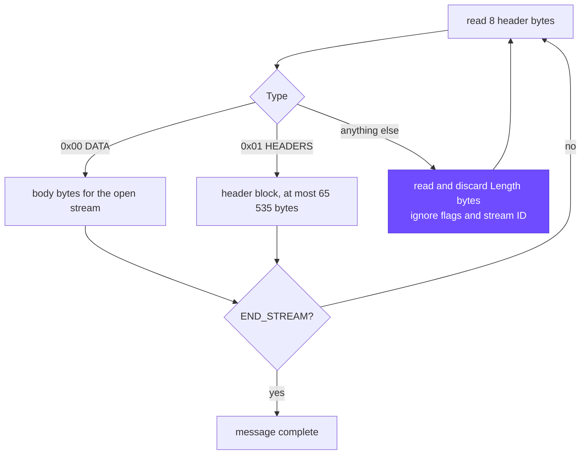

# bhttp-network-architecture

> BHTTP/1 carries HTTP requests and responses in binary frames with an 8-byte header. This repo has the spec, a file server (`bserve`), a client (`bcurl`) and hexdumps of real exchanges.


[](https://github.com/mohit-1710/bhttp-network-architecture/actions/workflows/ci.yml)

---

## Architecture

bserve and bcurl share no source code: bserve uses `src/bproto.c` and bcurl has its own codec in `src/cwire.c`, both written from [SPEC.md](SPEC.md). The purple boxes are where most of my design time went.


### Errors on one connection

bcurl numbers its requests 1, 2, 3 on a single connection. A 404 or a malformed request is answered on its own stream. Only a broken frame sequence (here a stream ID going backwards) gets a `400` on stream 0 and a close.

```mermaid
sequenceDiagram
    autonumber
    participant C as client (bcurl; a test peer sends the bad frames)
    participant S as bserve

    C->>S: UNKNOWN type 0xFA, stream 0 (--grease)
    Note right of S: skipped: read 29 bytes, discard, no reply
    C->>S: HEADERS stream 1 [END_STREAM]<br/>:method GET · :path /hello.txt
    S-->>C: HEADERS stream 1<br/>:status 200 · content-length 20
    S-->>C: DATA stream 1 [END_STREAM] "Hello, binary HTTP!\n"

    C->>S: HEADERS stream 2 [END_STREAM] :path /nope
    S-->>C: HEADERS + DATA stream 2: 404

    C->>S: HEADERS stream 3 with a bad header block
    S-->>C: HEADERS + DATA stream 3: 400

    C->>S: HEADERS stream 2 again (ID not increasing)
    S-->>C: HEADERS + DATA on stream 0: 400 with the reason
    S--xC: close
```

### Reading a frame

Client and server both run this loop. An unknown frame costs one read of Length bytes.



---

## The frame

```
 0                   1                   2                   3
 0 1 2 3 4 5 6 7 8 9 0 1 2 3 4 5 6 7 8 9 0 1 2 3 4 5 6 7 8 9 0 1
+-----------------------------------------------+---------------+
|                 Length (24)                   |   Type (8)    |
+---------------+-----------------------------------------------+
|   Flags (8)   |               Stream ID (24)                  |
+---------------+-----------------------------------------------+
|                 payload: Length bytes ...                     |
```

A real request for `/hello.txt` starts with the header `00 00 31 01 01 00 00 01`: Length 49, HEADERS, END_STREAM, stream 1. The 49-byte header block follows.

Ten names have one-byte tags (table in SPEC §5); everything else is length-prefixed.

---

## What bserve and bcurl do

| Area | Behaviour |
|---|---|
| Server (Track 1) | `bserve ./www 9000` reads binary frames, maps `:path` under the root, answers `200` with the file as DATA frames, or 400, 403, 404 or 405 as listed in SPEC §6. |
| Client (Track 2) | `bcurl -v localhost:9000/index.html` builds the request frame, writes the body to stdout, hexdumps every frame with `-v`, exits non-zero on 4xx and 5xx, and sends any extra paths on the same connection. |
| Unknown frames | Both sides skip frame types they do not know, on any stream and between any two frames. `--grease` sends a type `0xFA` frame first, to check that the server skips it. |
| Path safety | Files are opened one path component at a time from a descriptor for the root, with `O_NOFOLLOW` at every step, so a directory swapped for a symlink mid-request cannot lead outside. |
| Timeouts and caps | bserve drops a connection that sits idle, sends a request too slowly or reads a frame too slowly for longer than `-t` (default 30 s). It serves 128 connections at once, 32 per client address. |
| Truncated bodies | If a file read fails mid-body the server drops the connection instead of sending END_STREAM, and the client checks `content-length` against the bytes received. |

---

### Server path policy

SPEC §6 leaves file lookup to the server. bserve checks a request in this order and the first match decides:

| # | status | when |
|---|---|---|
| 1 | 400 | malformed or oversized header block, bad `%` escape, `%00`, or a `:path` over 1024 bytes |
| 2 | 405 | a method other than GET or HEAD |
| 3 | 403 | a path segment equal to `..` |
| 4 | 404 | any other segment starting with a dot (`.`, `.env`, `.git`) |
| 5 | 403 | the path, with symlinks followed, leads outside the root; for a missing file, the part that does exist already does (so a 404 never confirms a file outside) |
| 6 | 404 | missing (including under a directory that cannot be searched), a symlink loop or a chain of more than 8 dangling links, a resolved dot component, or not a regular file (FIFOs, sockets, a directory named `index.html`) |
| 7 | 403 | the file itself exists but may not be read |
| 8 | 500 | any other open or read failure |

---

## Design decisions

| Topic | Decision | Rejected |
|---|---|---|
| Header size | 8 bytes: 24 / 8 / 8 / 24 | HTTP/2's 9 bytes with a reserved bit and 31-bit IDs, which only pay off with multiplexing |
| Length | 24 bits, frames up to 16 MiB | 16 bits: fits v1's limits, but Length can never change later without breaking the skip rule |
| Stream ID | 24 bits, client counts 1, 2, 3 | none at all (no way to spot a stale frame); odd/even split (no server-started streams in v1) |
| Header names | 10-entry static table + literals | HPACK's dynamic table and Huffman coding: the Huffman code table alone has 257 entries, for a few bytes saved on a 57-byte request |
| String lengths | 1 byte below 128, else 2 bytes with the top bit set | fixed 2-byte lengths (a byte wasted on almost every field); HPACK prefix integers |
| End of body | END_STREAM, checked against `content-length` | either alone: without END_STREAM a sender cannot stream a body of unknown size, and without the length check a cut-off body looks complete |
| Version 2 | new frame types, negotiated by a frame v1 skips | a version byte in every header (a byte per frame that v1 never uses); a connection preface (extra bytes on every connection, and v1 peers could not tell one from a stray request) |

SPEC §8 has the longer argument, including HTTP/2's own 8-byte drafts.

---

## Numbers

Apple M5 Pro, loopback, release build (`make`); times are the middle of three runs:

| Measurement | Value |
|---|---|
| Request for `/hello.txt` on the wire | 57 bytes (HTTP/1.1 text: 85) |
| 10 000 requests over one connection, one at a time | 0.52 s, 19 000 requests/s (52 µs each) |
| 200 MB file, 12 208 DATA frames | 0.095 s, 2.1 GB/s, byte-identical |
| Framing overhead on a full DATA frame | 8 / 16 392 bytes = 0.05 % |
| Tests (C programs against a separate Python implementation) | 118 passing on Ubuntu and macOS, and again under ASan and UBSan ([CI](.github/workflows/ci.yml)) |
| Header-block fuzzing (`make fuzz`, under ASan and UBSan) | 300 000 mutated blocks; no crashes, and both decoders gave the same accept/reject result on every block |

---

## Run

```bash
make                                   # builds ./bserve and ./bcurl (C11, no dependencies)
./bserve ./www 9000
./bcurl -v localhost:9000/index.html
```

```bash
./bcurl localhost:9000/index.html /about.html /nope    # three requests, one connection; exits 4 for the 404
./bcurl -I localhost:9000/img/dot.png                  # HEAD; prints the response headers
./bcurl -v --grease localhost:9000/hello.txt           # an unknown frame first; the server skips it
./bcurl -v -H 'x-trace-id: 7f3a' localhost:9000/hello.txt   # a header outside the static table
make test                                              # the interop tests
```

| Program | Options |
|---|---|
| `bserve [-v] [-t seconds] <root> <port>` | `-v` hexdumps frames on the server side. `-t` (default 30) sets the server's idle, per-request and per-outgoing-frame deadlines; the tests use `-t 2`. |
| `bcurl [-v] [-I] [-X method] [-H 'name: value'] [-t seconds] [--grease] url [paths]` | `-v` hexdumps every frame to stderr. `-I` sends HEAD and prints the response headers. `-H host`, `user-agent` or `accept` replace the defaults. `-t` (default 30) is the connect timeout and the time each response frame has to arrive in full; unknown frames do not extend it. |

bcurl exits with 0 when every status is below 400, 4 for a 4xx, 5 for a 5xx, 3 for a protocol, timeout or output error, 2 when it cannot connect and 1 for bad arguments.

---

## Tests

[tests/interop.py](tests/interop.py) is a second implementation written only from SPEC.md, so a misreading of the spec that bserve and bcurl share still fails. The cases that took the most work:

- a header block of exactly 65 535 bytes, and one with 300 fields;
- a slow reader, a slow sender and an idle connection, each cut off by the deadlines;
- a FIFO, a dotfile behind a symlink, and a symlink into a sibling directory whose name starts with the root's name;
- 300 requests that the Python server counts as one TCP connection;
- a body that runs past `content-length`, and a connection error arriving in the middle of a body;
- bcurl started with stdout closed.

The rest of the list is printed by `make test`.

bserve's stderr is kept during the run, and the last check fails if it contains a sanitizer report. CI repeats the suite under `-fsanitize=address,undefined` and then runs `make fuzz`.

---

## Project layout

```
SPEC.md                 the protocol (docs/SPEC.pdf: the same text on two pages; docs/build.sh rebuilds it)
HEXDUMP.md              annotated captures: GET, 404, skipped frame, 400
src/bproto.[ch]         bserve's frame and header-block code, deadlines, -v hexdump
src/bserve.c            Track 1, the server
src/cwire.[ch]          bcurl's frame and header-block code
src/bcurl.c             Track 2, the client
tests/interop.py        Python implementation of the spec + the tests
tests/fuzz_hb.c         differential fuzzer: both header-block decoders must agree (make fuzz)
www/                    sample document root
.github/workflows/      CI: -Werror build and tests on Ubuntu and macOS, plus a sanitizer + fuzz job
```
